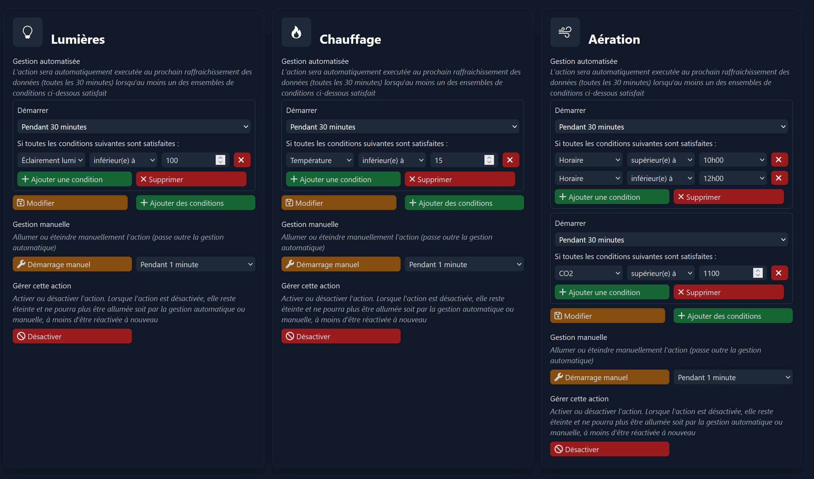
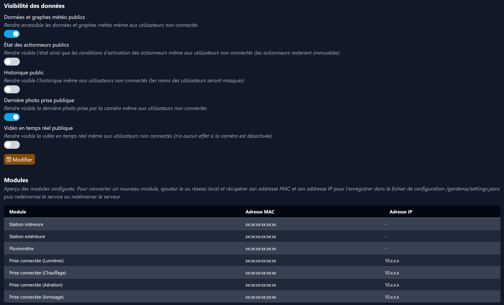
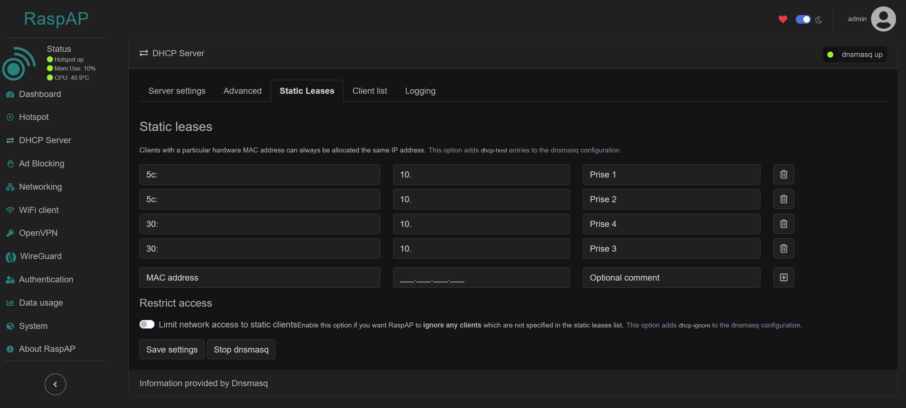

# 🌻 Gardenia





Gardenia is a greenhouse automation system designed to run on a Raspberry Pi. It collects data from various sensors and modules, and can automate actions such as watering, heating and taking pictures
based on conditions.

This project was done as a volunteer for a high school in France.

## Requirements

This project is designed to run on a Raspberry Pi with:

- [Raspberry camera](https://www.raspberrypi.com/documentation/accessories/camera.html)
- [Netatmo weather station](https://dev.netatmo.com/apidocumentation) and its modules
- [TP-link Tapo P100](https://www.tp-link.com/fr/home-networking/smart-plug/tapo-p100)
- GY-302 light sensor

A TP-link Tapo account and a Netatmo account are required to use this project. An additional Wifi dongle will be required to create the hotspot with RaspAP (unless a cabled connexion is available).

## Features

- Collected data graphs
- Manage actions based on conditions
- View camera stream and take pictures
- Event history
- Basic user management
- Basic system management

## Installation

Use [Raspberry Pi imager](https://www.raspberrypi.com/software) to install Raspbian Lite.

Open a shell (using SSH or directly on the Pi) and run the following commands:

```sh
# Perform upgrade
apt update
apt upgrade
apt autoremove
# Set wifi country
raspi-config
# Install RaspAP (say yes to all questions, no need for the vpn client though)
mv /etc/wpa_supplicant/wpa_supplicant.conf /etc/wpa_supplicant/wpa_supplicant.conf.bak
curl -sL https://install.raspap.com | bash
# Install camera
apt install -y python3-picamera2 --no-install-recommends
# Install tapo100 support
apt install python3-pip
pip install --break-system-packages git+https://github.com/almottier/TapoP100.git@main
pip install --break-system-packages jsonc-parser
# Install deno
curl -s https://gist.githubusercontent.com/LukeChannings/09d53f5c364391042186518c8598b85e/raw/ac8cd8c675b985edd4b3e16df63ffef14d1f0e24/deno_install.sh | sh
# Clone repository
apt install -y git
git clone https://github.com/lowlighter/gardenia.git /
# Configure settings
cd /gardenia
cp settings.example.jsonc settings.jsonc
# Create service
cp gardenia.service /etc/systemd/system/gardenia.service
cp gardenia_pins.service /etc/systemd/system/gardenia_pins.service
systemctl daemon-reload
systemctl enable gardenia
systemctl start gardenia
systemctl enable gardenia_pins
systemctl start gardenia_pins
```

You should now be able to access Gardenia web interface on the configured port in `settings.jsonc`

### Installing new weather modules

It is required to configure static leases for TP-Links. Connect on the RaspAP hotspot and configure them in the `DHCP Server` section.


